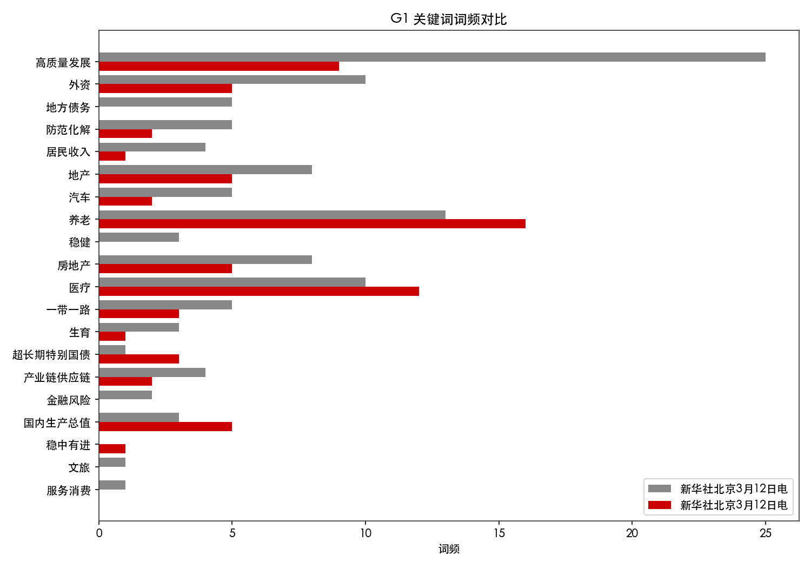
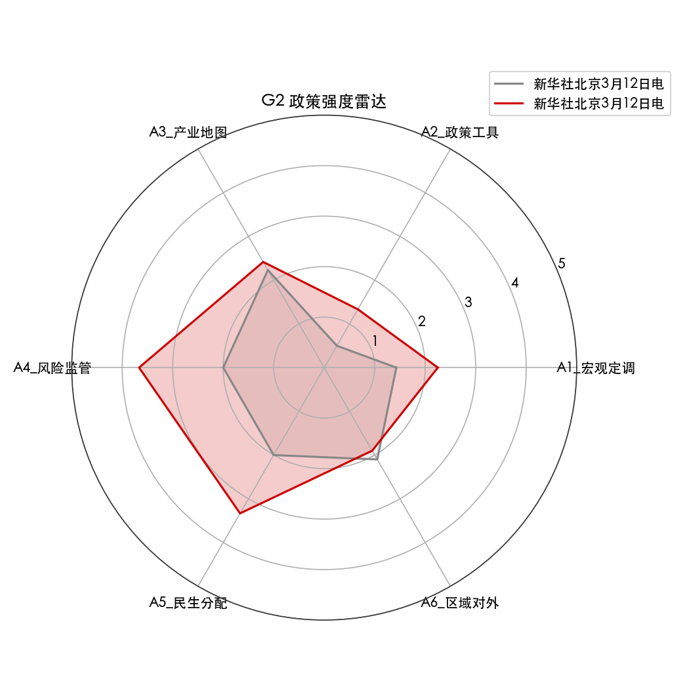
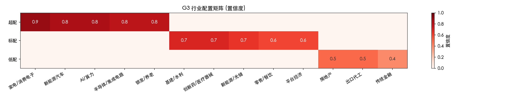
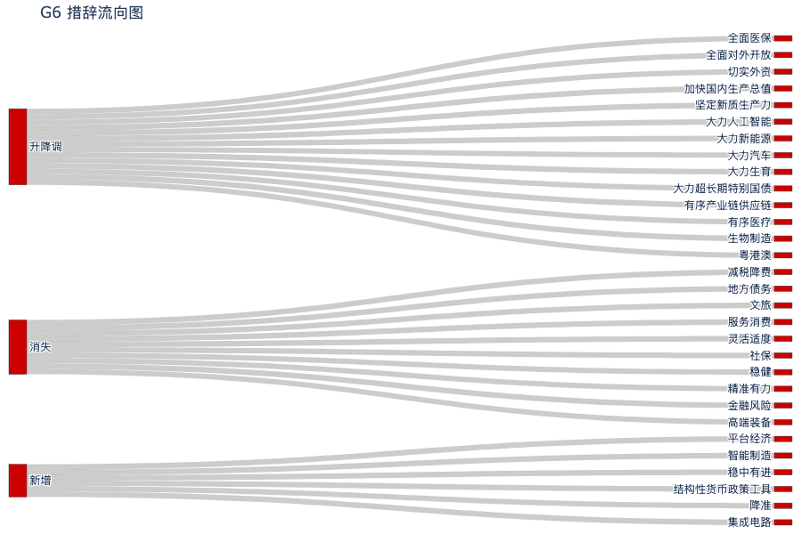
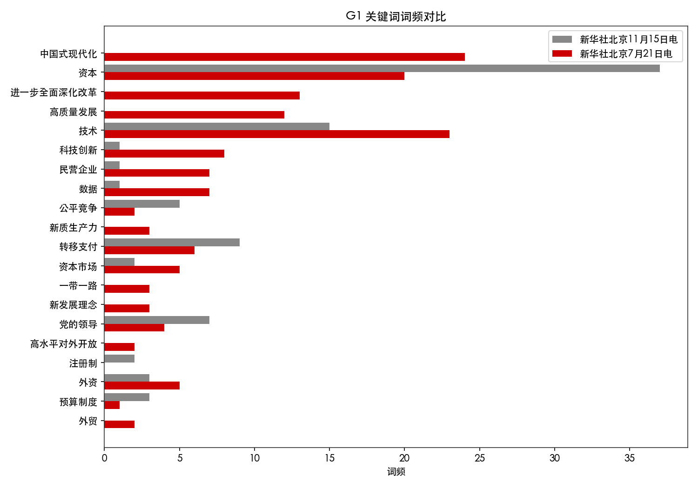
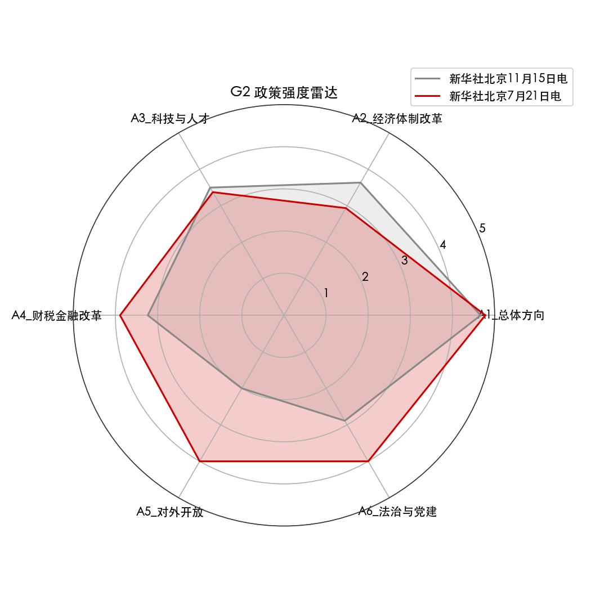
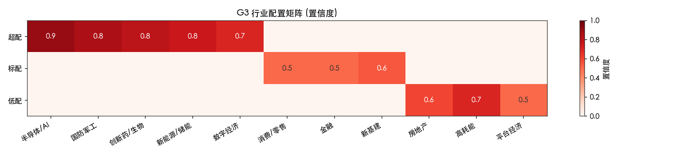
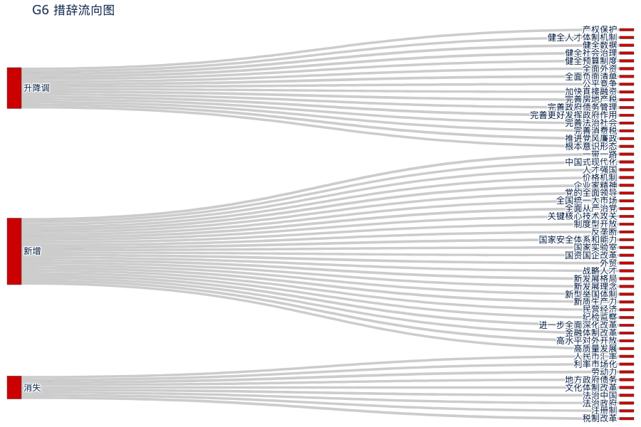

# Policy Diff Analyst

## 三月五号下午两点半，你的手机同时震了三下。

老板的微信："报告出来了，和去年比有什么变化？五点前给我一页纸。"

基金经理的邮件："今年消费和去年提法不一样，帮我拉一下措辞变化，看看是加码还是转向。"

客户群里已经有人在问："货币政策从'稳健'变成'适度宽松'，这是什么信号？要不要调仓？"

你打开两份文件。去年的 17,000 字，今年的 18,000 字。逐字看？一下午不够。等券商研报？最快也要明天早上。

**你把两份文件丢进了这个工具。**

**30 秒后，你的桌面上多了这些东西：**

一篇写好的深度解读文章，Word 格式，可以直接发给老板。一份标注版原文，改了哪句话红色高亮标得清清楚楚。一套图表，雷达图、桑基图、行业配置矩阵，截图就能贴 PPT。一份 Excel 数据表，指标对比、词频统计、强度打分，四个 Sheet 全部拉好。

五点前？你三点就发出去了。

---

## 这个工具能做什么

### 一、读得比你快，看得比你细

你读报告是从头到尾顺着读。它不是。

它先看**骨架**——今年的章节结构和去年一样吗？"消费"从第三章提到了第一章？这比任何一句措辞变化都重要，因为这意味着整个政策优先级翻了个个儿。

然后它拿着 **448 个关键词**逐句扫。不是 Ctrl+F 那种简单搜索——它按"宏观定调、政策工具、产业地图、风险监管、民生分配、区域对外"六个层面分门别类地扫。哪个层面在加码、哪个在收力，扫完就知道。

最后它给每个关键词**打强度分**。"大力推进"和"稳妥推进"，文字只差两个字，但政策信号天差地别。它用 0-5 分把这种差别量化出来。

> 举个真实例子：2025 年报告里，"货币政策"前面的修饰词从"稳健"变成了"适度宽松"。这是 14 年来首次改口。引擎自动捕捉到这个变化，标注强度从 2 分跳到 4 分，并归入"A2 政策工具"层。

### 二、不只告诉你"变了什么"，还告诉你"所以呢"

市面上的文本对比工具到"变了什么"就停了。这个不一样。

它背后跑的是一套 **12 章分析方法论**——从中金、兴证、国君这些头部券商的宏观策略框架里提炼出来的。每一个差异点，它都走一遍完整的推理链：

**是什么** → 措辞具体怎么变的
**为什么** → 背后的经济背景和政策意图是什么
**所以呢** → 对哪些行业有影响、该怎么应对

赤字率从 3% 提到 4%，它不只是告诉你"涨了一个点"——它会分析这背后是财政扩张信号，对应基建、环保、新能源板块可能受益，同时提示你国债供给压力可能压制债市。

### 三、同一份数据，三种说法

写给机构客户的，和发朋友圈的，能一样吗？

| 风格 | 什么感觉 | 给谁看 |
|------|---------|--------|
| **投研派** | 像中金首席写的晨报，严谨、有数据、有置信度 | 基金经理、分析师、机构客户 |
| **媒体派** | 像《财经》杂志的封面报道，有故事线、有节奏感 | 财经记者、政策研究者、领导汇报 |
| **大白话** | 说人话，不掉书袋，"这事跟你的钱有什么关系" | 散户、非金融背景的老板、朋友圈传播 |

选一个风格，出来就是一篇完整的文章，不用你再改。

### 四、出图，能直接贴 PPT 的那种

每次分析自动生成一组可视化——词频对比柱状图、政策力度雷达图、行业配置矩阵、措辞流向桑基图——截图就能放 PPT，不用你再开 Excel 手画。（效果见下方真实案例。）

### 五、什么格式都吃，甚至什么都不用给

手上有 Word？丢进来。有 PDF？丢进来。只有一个网页链接？也行，自动抓。

甚至——你什么都不用准备，跟它说一句**"对比最新两版政府工作报告"**，它自己去政府官网找、自己抓、自己比。

### 六、不只是政府工作报告

五类中国最核心的政策文档，全覆盖：

- **政府工作报告** — 每年 3 月，年度经济政策总纲
- **中央经济工作会议** — 每年 12 月，来年方向风向标
- **五年规划纲要** — 每 5 年，中期战略赛道全景图
- **三中全会决定** — 改革路线图，制度级变化
- **货币政策执行报告** — 每季度，央行的心思全在字里行间

每类文档都有**专门调教的关键词库**（合计 448 个），不是通用 NLP 硬套的。

### 七、词库会自己长

政策语言每年都在变。"新质生产力"在 2024 年之前是不存在的。

每次分析完，引擎会自动发现报告里反复出现、但不在现有词库里的新词，提示你："要不要把这个词加进去？"

下一次分析，词库就更完整了。

---

## 它是怎么做到的

> 这部分写给想了解原理的人。不感兴趣可以跳过，不影响使用。

引擎分三层，彼此独立：

**第一层：纯 Python 分析引擎**（零 AI 依赖）
解析文档 → 提取结构 → 关键词扫描 → 强度评分 → 量化指标抽取 → 生成 Excel + 图表 + 标注版原文。这层完全确定性计算，跑在你本地，不调任何 API。

**第二层：通用分析 Prompt**
一份 markdown 文件（`prompts/analysis_prompt.md`），定义了 9 大分析维度和输出格式。任何大语言模型都能读懂——Claude、GPT-4、Gemini、开源模型，都行。

**第三层：平台适配**
给 Claude Code 写了一份 `SKILL.md`，给 Codex 写了一份 `AGENTS.md`。换平台？写一份薄薄的适配文件就行，引擎和 Prompt 完全复用。

| 平台 | 怎么接 |
|------|--------|
| Claude Code | 装了就能用，说句话自动触发 |
| Codex CLI | 读 `adapters/codex/AGENTS.md` |
| 其他 AI 平台 | 跑 `pda compare` + 喂 prompt 给你的 LLM |
| 不用 AI | `pda compare` 命令行直接跑，拿数据自己分析 |

---

## 真实案例：2024 vs 2025 政府工作报告

下面是引擎跑出来的真实结果，不是编的。输入是两份政府工作报告原文（2024 年 17,425 字 vs 2025 年 18,395 字），30 秒产出。

### 结构级发现：消费被提到了第一位

引擎首先对比了两份报告的章节骨架，发现了一个重大调整：

> **"扩大内需 / 提振消费"从工作任务的第三项跃升至第一项。** "产业体系 / 新质生产力"从第一降至第二，"科教兴国"从第二降至第三。

这不是措辞变化——这是**战略优先级的重新排序**。消费在今年被放到了所有经济工作的最前面。

### 关键词级发现：31 处差异，这几个最值得关注

| 变化 | 关键词 | 信号 |
|------|--------|------|
| 新增 | 适度宽松、降准、结构性货币政策工具 | 货币政策 14 年来首次转向宽松 |
| 新增 | 平台经济 | 平台监管转向支持发展 |
| 新增 | 集成电路、智能制造 | 科技自主可控清单更具体 |
| 新增 | 稳中有进 | 定调从"稳中求进"升级 |
| 消失 | 稳健（货币政策修饰）、灵活适度、精准有力 | 旧的货币政策措辞整体换血 |
| 消失 | 减税降费 | 财政工具重心从减税转向支出 |

### 强度变化：风险监管力度飙升

| 维度 | 去年 | 今年 | 变化 |
|------|------|------|------|
| 宏观定调 | 1.4 分 | 2.2 分 | +0.8 加码 |
| 政策工具 | 0.5 分 | 1.3 分 | +0.8 加码 |
| **风险监管** | **2.0 分** | **3.7 分** | **+1.7 大幅加码** |
| 民生分配 | 2.0 分 | 3.3 分 | +1.3 加码 |
| 区域对外 | 2.1 分 | 1.9 分 | -0.2 微降 |

风险监管从 2.0 直接跳到 3.7，是所有维度里变化最大的——对应的是房地产、地方债、金融风险相关措辞全面加强。

### 核心数字变化

| 指标 | 去年 | 今年 | 信号 |
|------|------|------|------|
| 赤字率 | 3% | **4%** | 20 年来最高，财政大幅扩张 |
| 专项债 | 3.9 万亿 | **4.4 万亿** | +5,000 亿，基建继续加码 |
| 中央预算内投资 | 7,000 亿 | **7,350 亿** | +350 亿 |
| 一般公共预算支出 | 28.5 万亿 | **29.7 万亿** | +1.2 万亿 |

### 产出的图表（实际截图）

<table>
<tr>
<td align="center"><br/><b>词频对比</b></td>
<td align="center"><br/><b>政策力度雷达</b></td>
</tr>
<tr>
<td align="center"><br/><b>行业配置建议</b></td>
<td align="center"><br/><b>措辞流向</b></td>
</tr>
</table>

> 以上全部是引擎自动产出，零人工编辑。从输入两份原文到全部产出，耗时 30 秒。

### 产出的解读文章长什么样？（大白话风格，点击展开）

以下是引擎自动生成的完整分析文章，选用"大白话 / 投资派"风格，面向散户和非金融背景读者。**零人工编辑，原样展示。**

<details>
<summary><b>点击展开：2024 vs 2025 政府工作报告 · 大白话深度解读（全文）</b></summary>

---

#### 一句话结论

2025年政府工作报告的核心信号：**钱袋子大开、消费上头条、AI满场跑。** 简单说，政府在用16年来最猛的财政+货政组合拳，逼自己把"让老百姓花钱"这件事干成。货币政策从"稳健"变成"适度宽松"，这四个字上一次出现还是2008年金融危机的时候。赤字率首次突破3%直接跳到4%，多借了1.6万亿。如果把国家财政比作一个家庭，今年这个家庭决定把信用卡额度翻倍来装修房子——只不过装修的重点从盖新房（基建投资）变成了给厨房升级（促消费）。

---

#### 大方向：今年政策到底在干嘛？

先看全局框架。如果把政府工作报告比作一份菜单，今年最大的变化是把"促消费"从配菜升级成了主菜——而且是排在第一道的主菜。

- 2024年工作任务排序：①产业体系/新质生产力 → ②科教兴国 → ③扩大内需……消费排第三。
- 2025年变成：①大力提振消费/扩大内需 → ②新质生产力 → ③科教兴国。

**消费直接从老三跳到了老大的位子，产业和科技各后退一位。**

这不是简单的文字搬家。在中国政策文件里，章节排序 = 执行优先级。消费第一次坐上头把交椅，说明决策层认为：现在中国经济最大的堵点不是"造不出来"，而是"卖不出去"——老百姓口袋里有钱但不敢花、不想花。

**政策周期定位：** 2025年处于"稳增长期"——财政大幅扩张、货币明确宽松、消费和投资双管齐下，是典型的逆周期扩张姿态。上一次这么猛的组合是2008年的"四万亿"时期。当然，这次更聪明——钱不是一股脑砸基建，而是一部分给消费（以旧换新3000亿）、一部分给科技（专项债扩围）、一部分化旧账（6万亿化债）。

---

#### 掰开揉碎讲：五个跟你最相关的变化

**【变化一：钱印多了——货币政策16年来最大转向】**

- 2024年说法："稳健的货币政策要灵活适度、精准有效"
- 2025年说法："实施适度宽松的货币政策"

翻译成人话："灵活适度"就像央妈说"有需要我会帮你"；"适度宽松"等于央妈直接说"钱管够，尽管花"。

"适度宽松"这四个字上一次出现是2008年全球金融危机。那次之后A股从1664涨到3400。这次当然不能简单类比，但信号很清楚：降准降息还会有，而且报告明确写了"适时降准降息"。

> **跟你有什么关系？** 房贷利率大概率还会降；银行存款利率也会降（钱放银行越来越不划算）；如果你有股票，宽松的钱得找地方去，一部分会流进股市。

**【变化二：政府借钱创纪录——赤字率首破4%】**

2024年赤字率3%，赤字4.06万亿。2025年赤字率4%，赤字5.66万亿，多了1.6万亿。

4%是什么概念？过去30年，中国政府的赤字率几乎没突破过3%。3%被视为财政纪律的"红线"。今年一脚踩过去，说明形势确实需要加码。

更夸张的是总账：今年新增政府债务总规模11.86万亿元。打个比方，相当于广东省2024年全年GDP的约85%——一年借的钱快赶上中国最富省份干一年了。

**【变化三：消费上头条——"大力提振"取代"着力扩大"】**

从"着力"到"大力"——在政策语言里，"着力"相当于领导说"好好干"，"大力"相当于"必须干成，干不成要问责"。力度升了两个档位。

新增3000亿超长期特别国债专门支持"消费品以旧换新"。去年试点1500亿，效果不错（家电零售增长12.3%），今年翻倍。

还有一个细节：报告说"多渠道促进居民增收，推动中低收入群体增收减负"——"增收减负"同时提，说明政策终于意识到：不提高收入，光喊消费没用。

> **跟你有什么关系？** 家电、汽车以旧换新补贴会继续甚至加码；工资可能会涨一点；个税或社保负担可能减轻。但通缩压力也在（CPI目标从3%降到2%），东西未必会涨价。

**【变化四：AI成了最亮的仔——人工智能力度暴升】**

2024年只是点了一句"开展人工智能+行动"。2025年变成"持续推进人工智能+行动"，后面跟了一长串具体方向："智能网联新能源汽车、人工智能手机和电脑、智能机器人、智能制造装备"。

"集成电路"首次被单独点名，"量子科技"、"具身智能"、"6G"全部写入"未来产业"清单。新质生产力的修饰词从"大力"（4分）变成了"坚定"（5分，最高级别）。最高分意味着：无论经济好不好，这笔钱一定花。

**【变化五：催生力度拉满——"发放育儿补贴"首次写入】**

2024年报告关于生育的表述非常简短。2025年力度从0直接拉到4（"大力"级别），新增表述包括"制定促进生育政策"、"发放育儿补贴"、"大力发展托幼一体服务"。

"发放育儿补贴"在政府工作报告里是第一次出现。以前地方零星试点过，但从来没有在国家级文件里这么直白地写"发钱鼓励生孩子"。

> **跟你有什么关系？** 如果你计划要孩子，育儿补贴可能很快落地。如果你是投资者，养老、托幼、银发经济相关的公司值得关注。

---

#### 操作提示

**C1 市场风格判断：** 宽财政+宽货币+消费优先 → 内需/消费风格占优，其次是科技成长（AI+半导体+新能源车）。纯出口和传统金融可能跑输。

**C2 行业配置建议：**

**[超配]（政策强力加持）：**
- 家电/消费电子 — 以旧换新3000亿直接拉动
- 新能源汽车 — "大力发展智能网联新能源汽车"
- AI/算力 — "人工智能+"持续推进 + 智能终端全面点名
- 半导体 — "集成电路"首次在报告中被单独点名
- 银发/养老/托育 — "大力发展银发经济" + "发放育儿补贴"首次出现

**[标配]（政策延续，无超预期）：**
- 基建/水利 — 专项债增量5000亿，但不是今年重点方向
- 创新药 — "支持创新药和医疗器械发展"延续，无增量
- 平台经济 — 从"规范"转向"促进健康发展"，边际改善

**[低配]（政策淡化或存在不确定性）：**
- 房地产 — "止跌回稳"延续但无增量刺激
- 纯出口链 — 政策重心转内需
- 传统金融 — "地方中小金融机构风险处置"仍是重点，承压

**C3 交易节奏：**
- 短期（两会后1-3个月）：消费补贴细则落地，家电/汽车脉冲行情
- 中期（Q2-Q3）：降准降息窗口，科技成长接力
- 下半年：关注CPI能否回升，若持续低迷则可能有新一轮刺激

---

#### 预期差分析

**[超预期]：**
- 赤字率4%：会前市场一致预期3.5-3.8%，超出预期上沿
- 货币政策"适度宽松"正式写入：很多人认为报告表述会软化，没有——原样照搬
- 新增政府债务总规模11.86万亿：首次公开披露，比隐含预期高约1万亿
- "育儿补贴"首次写入：完全超预期，之前几乎没有机构预测到

**[低于预期]：**
- 房地产——没有更强的"救市"措施，表述偏温和
- 减税降费——今年删除了"减税降费"表述，政策工具从"减税"转向"花钱"

---

#### 风险与反向观点

① 财政扩张的持续性存疑。4%赤字率是非常规操作，如果经济没有如期回升，明年能否维持？

② "适度宽松"≠大水漫灌。央行强调"结构性"，宽松是定向的，不是全面放水。

③ 消费提振不等于消费回升。去年也喊了消费，实际CPI只有0.2%。核心问题是居民收入预期和就业信心。

④ 新质生产力"坚定"≠立刻出业绩。AI、半导体都是长周期赛道，小心主题炒作后的估值回落。

⑤ 国际环境不确定性。报告明确提到"单边主义、保护主义加剧"——如果贸易摩擦升级，内需能否完全对冲外需下降？

---

*免责声明：本文基于公开政策文件的文本对比分析，由 AI 辅助生成，仅供研究参考，不构成投资建议。*

</details>

---

## 真实案例 2：2013 vs 2024 三中全会决定（跨越十一年的改革对比）

政府工作报告是年度对比，三中全会则是跨越十年的制度级变迁。引擎同样适用。

输入：十八届三中全会《关于全面深化改革若干重大问题的决定》（2013，21,800 字）vs 二十届三中全会《关于进一步全面深化改革 推进中国式现代化的决定》（2024，22,336 字）。

### 框架级发现：整个目录被重组了

16 章变 15 章，看似只少了一章，实际内部剧烈重组——8 个旧章节被删除或合并，7 个新章节被创建：

> **"高质量发展"独立成章（新增第三章），"支持全面创新"独立成章（新增第四章），"国家安全"从一句话升级为完整一章（新增第十三章）。**

2013 年的目录像"分部门任务清单"，2024 年变成了"功能整合框架"——改革从单点突破转向系统集成。

### 核心措辞变化

| 维度 | 2013 年 | 2024 年 | 信号 |
|------|--------|--------|------|
| 改革叙事 | "攻坚期和深水区"，破冰突围 | "关键时期"，系统集成 | 从"破"到"立" |
| 最高框架 | 全面深化改革 | 中国式现代化 | 改革服务于现代化 |
| 科技定位 | 散落在市场体系章节 | 独立第四章 + 新型举国体制 | 战略优先级跃升 |
| 民营经济 | "非公有制经济" | "民营经济" + 促进法 | 从政策承诺到立法保障 |
| 对外开放 | 放宽投资准入 + 自贸区 | 制度型开放 + 规则对接 | 从降关税到改规则 |

### 强度评分变化：对外开放翻倍

| 维度 | 2013 | 2024 | 变化 |
|------|------|------|------|
| 总体方向 | 4.67 | 4.78 | +0.11 |
| 经济体制改革 | 3.64 | 2.94 | -0.70（2013年"决定性作用"太强，拉高了基数） |
| 科技与人才 | 3.50 | 3.38 | -0.12（分数降但内涵大幅升级） |
| 财税金融 | 3.23 | 3.89 | +0.66 |
| **对外开放** | **2.00** | **4.00** | **+2.00 翻倍** |
| 法治与党建 | 2.89 | 4.00 | +1.11 |

### 高频词爆发："机制"出现 201 次

| 词 | 2013 | 2024 | 倍率 |
|-----|------|------|------|
| 机制 | 90 | 201 | 2.2x |
| 完善 | 112 | 196 | 1.8x |
| 健全 | 82 | 158 | 1.9x |
| 体系 | 54 | 132 | 2.4x |

这组数据最直白地说明了 2024 年改革的核心思路：不是搞大动作，而是把每个细节的制度"机制"都建起来。十一年前是画蓝图，现在是一砖一瓦地砌。

### 产出的图表

<table>
<tr>
<td align="center"><br/><b>词频对比</b></td>
<td align="center"><br/><b>政策力度雷达</b></td>
</tr>
<tr>
<td align="center"><br/><b>行业配置建议</b></td>
<td align="center"><br/><b>措辞流向</b></td>
</tr>
</table>

### 产出的解读文章长什么样？（媒体派风格，点击展开）

以下是引擎自动生成的完整分析文章，选用"媒体派"风格（类似《财经》杂志深度报道），面向政策研究者和财经记者。**零人工编辑，原样展示。**

<details>
<summary><b>点击展开：2013 vs 2024 三中全会 · 媒体派深度解读（全文）</b></summary>

---

#### 引子

2024年7月18日，北京。当二十届三中全会的《决定》全文公布时，不少政策研究者的第一反应是翻出2013年那份十八届三中全会的《决定》做对照。

十一年前，"使市场在资源配置中起决定性作用"这句话曾经让整个市场为之振奋——从"基础性作用"到"决定性作用"，一个词的变化引发了一轮"改革牛"行情。

十一年后的这份文件，没有那样石破天惊的单句话，但藏在两万多字里的变化，或许比当年那一句更加深远。因为这一次，改革的叙事逻辑本身变了。

---

#### 全局速览：一张重组的施工图

最直观的变化写在目录上。2013年的《决定》有16章，2024年变成了15章——数字上只少了一章，但内部发生了剧烈的"拆迁重建"：8个旧章节被删除或合并，7个新章节被创建。

2013年的章节像是改革任务的"分部门清单"——经济制度一章、市场体系一章、政府职能一章，各管一摊。2024年则打破了部门墙，按"功能"重新组合："高质量发展"统合了原来分散在多章的产业、市场、基建议题；"宏观经济治理"把财税、金融、规划拉到一个框架下；"支持全面创新"把教育、科技、人才三合一。

如果说2013年的改革蓝图是"每个房间都要装修"，2024年则是"重新设计了户型"。

---

#### 从"决定性作用"到"放得活管得住"

2013年《决定》最被记住的一句话——"使市场在资源配置中起决定性作用"——在2024年的文本中被完整保留了。但围绕它的语境发生了微妙变化。

2013年的原文是："使市场在资源配置中起决定性作用和更好发挥政府作用。"这是一个突破性的表态，重点在"决定性"三个字，它取代了此前十多年"基础性作用"的表述。

2024年的表述变成了："充分发挥市场在资源配置中的决定性作用，更好发挥政府作用"，紧接着是一句2013年没有的新话——"既放得活又管得住"。

这六个字值得细品。"放得活"承接了市场化改革的方向，"管得住"则是近年来监管实践的总结——从平台经济整治到房地产风险化解，政府的边界感在不断调整。这不是改革的倒退，而是改革经验的沉淀：完全放任和过度管控都走不通，找到"活"与"住"的平衡才是治理能力现代化的核心命题。

然而，值得注意的是，经济体制改革维度的政策强度评分从3.64下降到2.94，是所有维度中唯一显著下降的。这不是因为改革在退步，而是因为2013年那个"决定性作用"的突破力度太大——后来者很难再超越。2024年的经济改革更多是"完善"和"健全"，措辞力度天然低于"坚决突破"。

---

#### 科技创新：从"市场导向"到"举国体制2.0"

如果只看一个变化来判断这十一年中国改革方向的漂移，那就看科技。

2013年的科技改革写在第三章"完善现代市场体系"下面的一节里，核心思路是："建立主要由市场决定技术创新项目和经费分配、评价成果的机制"。让市场来选方向、定价格、评成果——这是典型的市场化改革逻辑。

2024年，科技创新独占了第四章——"构建支持全面创新体制机制"，核心思路变成了"新型举国体制"和"有组织的科研"。国家实验室、关键核心技术攻关、战略科学家……这些词在2013年几乎看不到。

为什么会有这样的转向？答案藏在过去十一年的国际环境变化里。2013年，中国还可以在全球化的框架下"引进消化吸收再创新"；2024年，半导体禁令、实体清单、技术脱钩让"自主可控"从可选项变成了必选项。"举国体制"不是回到计划经济，而是在"卡脖子"压力下的适应性调整。

但这里存在一个深层张力：举国体制的边界在哪里？哪些领域需要国家力量集中突破（如光刻机），哪些领域应该让市场自发创新（如互联网应用）？2024年的《决定》同时强调了两者，却没有画出清晰的分界线。这条线怎么画，将决定未来十年中国科技创新的效率和活力。

---

#### 民营经济：从"非公"的身份到立法的保障

2013年《决定》的用词是"非公有制经济"和"非公有制企业"。2024年《决定》用的是"民营经济"和"民营企业"。

这个称谓变化看似微不足道，实则意味深长。"非公"是一个"排除法"定义——你不是公有的，所以你是"非公的"。它的参照系是国有经济。"民营"则是一个"正名"——它有自己的身份，不需要通过否定别人来定义自己。

更实质的变化是，2024年《决定》明确提出"制定民营经济促进法"。这是历史上第一次将民营经济的保护上升到立法层面。在此之前，民营经济的政策保障主要依赖于党中央文件和国务院"意见"——它们有指导性，但没有法律的刚性和稳定性。

为什么需要这部法？2020年到2022年，从教培行业一夜归零到平台经济的监管风暴，民营企业家的信心经历了剧烈波动。"两个毫不动摇"说了很多遍，但如果没有法律的硬约束，市场的信任总是脆弱的。

"制定促进法"四个字，是对过去几年信心危机的制度性回应。它传递的信号是：保护民营经济不再只是"政策善意"，而是"法定义务"。

---

#### 对外开放：从关税壁垒到规则对接

对外开放是所有维度中变化最剧烈的——政策强度评分从2.0直接跳到4.0，翻了一倍。

2013年的开放还是传统路径：放宽外资准入、建设自贸区、鼓励企业走出去。这些措施的共同特点是"降门槛"——让商品和资本更容易进出。

2024年的开放则指向更深层的"制度型开放"："主动对接国际高标准经贸规则，在产权保护、产业补贴、环境标准、劳动保护、政府采购、电子商务、金融领域等实现规则、规制、管理、标准相通相容。"

从"降关税"到"改规则"，这是一个质的飞跃。降关税影响的是进出口价格，改规则影响的是营商环境、治理方式甚至官员行为模式。它的难度也高出数量级——你不能只改一个部门的规定，你需要改整个治理体系的底层逻辑。

这一变化的国际背景是：CPTPP（全面与进步跨太平洋伙伴关系协定）和DEPA（数字经济伙伴关系协定）等高标准协定成为全球贸易规则的新基准。中国要参与，就必须在规则层面做出调整。2024年《决定》中那段看似抽象的"规则、规制、管理、标准相通相容"，其实就是加入CPTPP的制度准备。

---

#### 延展思考：十一年后的改革，还有多少"硬骨头"?

纵向来看，2013年和2024年的两份《决定》代表了中国改革的两个阶段。2013年是"破冰"——在思想观念和利益格局上打开缺口。2024年是"建制"——在缺口的基础上搭建系统性的制度框架。

但"建制"阶段面临一个固有矛盾：制度一旦建成，它本身就可能成为新的利益格局。今天建立的"全国统一大市场"、"央地财政关系"、"国家安全体系"等制度框架，是否会在运转过程中产生新的利益固化？

横向来看，2024年《决定》面临的外部环境比2013年复杂得多。2013年的改革是在全球化红利尾声中展开的，中国仍然可以"以开放促改革"。2024年，全球化退潮、技术脱钩、地缘冲突使得改革必须在"发展"和"安全"之间反复权衡。

"统筹发展和安全"在文中出现多次。但统筹的难点在于：安全是可以无限扩展的——任何领域都可以被定义为"安全相关"。如果安全的边界过宽，开放和改革的空间就被压缩；如果边界过窄，又可能在关键时刻措手不及。

十一年前，"决定性作用"四个字让市场相信改革是"动真格的"。十一年后，市场需要的不仅是宏大叙事，更是每一条改革措施的落地执行。2029年是这份《决定》给自己设定的期限。到那时，今天写在纸上的承诺将接受现实的检验。

---

*免责声明：本文基于公开政策文件的文本对比分析，由 AI 辅助生成，仅供研究参考，不构成投资建议。*

</details>

---

## 三分钟上手

**Claude Code 用户**（最省事）：
```bash
git clone https://github.com/carykwok/policy-diff-analyst.git ~/.claude/skills/policy-diff-analyst
cd ~/.claude/skills/policy-diff-analyst && pip install -e .
```
装完对 Claude 说一句话就行，比如："用大白话帮我对比 2024 和 2025 年政府工作报告。"

**命令行用户**：
```bash
pip install -e .
pda compare --old 旧版.txt --new 新版.txt --file-type govt_work_report
```

**开发者**：
```bash
pip install -e ".[dev]"
pytest    # 71 tests
```

---

## License

MIT
